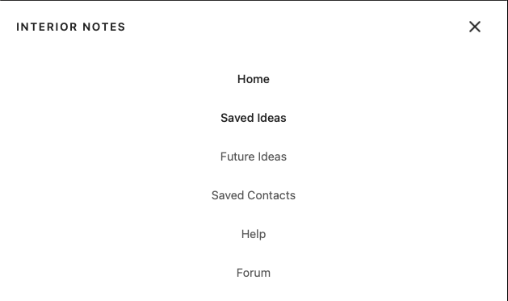

# FigmaMCPTest
Having learnt about the Figma MCP integration, I wanted to test out the how easy it is to do this and explore what is and is not feasible. 

# The Process 
1. Started out by designing a basic navbar component in figma with a simple open and close interaction when a user clicks on the hamburger menu. 

2. I then linked my Cursor IDE to my figma space using the new MCP integration and then gave the tool a simple prompt:

*"Imagine you are a world class user experience engineer and you are working on a new navbar for an application that allows interior designers to note take and store ideas for future reference. 

The navbar in question is going to be a focul point for the site and it is essential that it is easy to navigate and intuitive. 

You have started the process of designing the navbar component in figma and the designs are stored at the following URL: \[Removed]\

There are 5 requirements which the new toolbar must follow and these are:

1. The toolbar must allow users to navigate to the following pages: "Home", "Saved Ideas", "Future Ideas", "Saved Contacts", "Help", "Forum". These labels must be used explicitly. 
2. Any build component must be built using python and javascript and django programming languages and you are only allowed to use packages which are tried and tested.
3. There are two option in the navbar and when the user clicks on the handburger menu, the component should expand and expose the other three options. There should some subtle and smooth animation in the transition from closed to open.
4. The colour pallet used for the component should be the same as that used in the figma component. 
5. The final component should try, unless reasonably impossible, to obey all of the WCAG 2.2 Accessibility Guidelines. 

Your task is to build the component. 

Feel free to ask any clarifying questions before you build the component."*

3. I then reviewed the plan which the tool had put together and gave further details around my expectations. Specifically i gave it further information around Font Size and Weights. 

4. The tool then built the project. 

# Learnings 

### Mock-Up

### Generate Design

## How they compare

I was surprised by how the implemented feature used deviated from the prototype. Things like the alignment of buttons in the extended menu and, on larger displays, the AI decided to show all menu options in the navbar. 

Stylistically, the colour pallette is pleasent but details such as the design of the primary buttons and Interior Notes heading are interesting deviations. Emphasising the need to be explicit on what you are requesting. 

I am however certain that with some further prompting, and by perhaps suplying the tool with more details designs, it could avoid and mitigate. 

